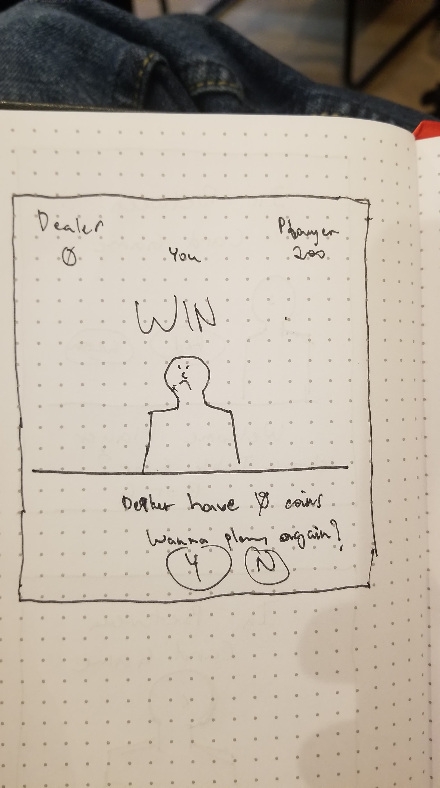
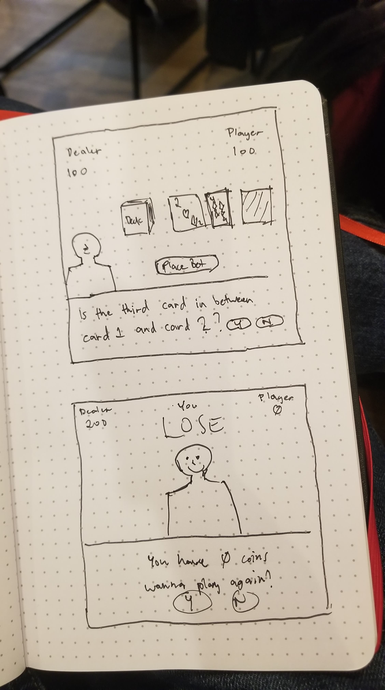
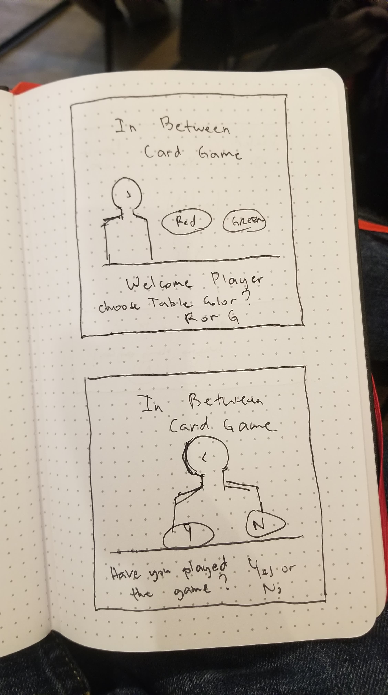

TODO: make a readme

In Between Card Game

This is a card guessing game. The app starts displaying a welcome page. As the user hovers the mouse a dealer will pop up at the side tells you a greeting then asks which table does the player want to play the game? Buttons will show up for option (Red or Green). After the user press the desired option the app then loads the table with the desired color table. The dealer then asks if the player has played the game, two buttons shall show up (Yes or No). If the player clicks Yes, the dealer will say it's greetings then proceeds to load the game. If player clicks No, the butler then introduces the player to the mechanics of the game.

Mechanics of the Game

-The dealer will teach you how the game works.
-A dealer and have 100 worth of coins to start.
-The goal of the game is to beat the dealer by getting all the dealers coin.
-There is a deck of cards, the dealer will draw two cards and shows them up face up to the table
-The dealer will mention the cards rank and suits to the player
-The dealer will then draw the third card and places it besides the other cards facedown.
-The dealer asks for the player to guess if the card is in between the first card or second card (Yes or NO)
  -If the player says YES the dealer asks how much are you willing to bet? User inputs the amount.
  -The player coins will be reduced depending on the players bet.
-After the player picks an option the dealer will then unveils the third card and shows it to the player.
-If the third card is in between the first and second card the user wins the bet
  -The dealers coins will be reduced depending on the amount of bet
  -The reduced coins from the dealer will be added to the players coins
-else if the third card is not in betweet the first and secord card the user loses the bet
  -The amount of bet will be added to the the dealers coin.
-The game resets back to drawing cards again.
-The game ends if either the player or the dealers coin reaches 0.

